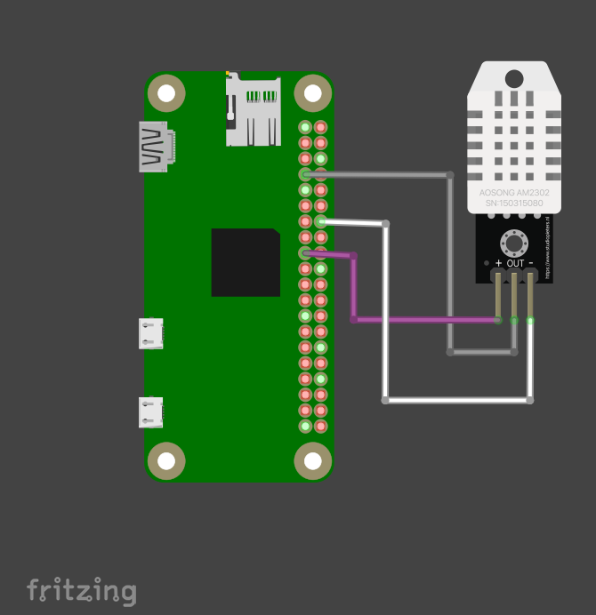

# Simple temperature measurement
The Temperature Notifier sample demonstrates how to use IoT in order to create a "smart" termometer that send to you informations about temperature and humidity, whenever you want, wherever you are(if you have internet connnection, of course☺). The sample take the request from the user, read temperature and humidity through the sensor and send the information about temperature and humidity as a notification on device.

## Schematics 

  - Wire **Power Supply Pin (+)** of DHT22 to any **3v3 Power Pin** on Pi
  - Wire **Data Signal Pin (out)** of DHT22 to **GPIO 4 Pin (Physical Pin 7)** on Pi
  - Wire **Ground Pin (-)** of DHT22 to any **Groud Pin** on Pi
  

## Assembly, Run, Test

## Pre-requisites
- IoT Development Board(I'm using [Raspberry Pi Zero WH](https://www.optimusdigital.ro/ro/pi-zero-unlimited/4579-raspberry-pi-zero-wh-cu-header-de-pini.html))
- Temperature and Humidity sensor (I'm using [DHT22 Temperature and Humidity Sensor Module](https://www.optimusdigital.ro/en/temperature-sensors/1449-dht22-temperature-and-humidity-sensor-module.html))

## Setup and Build
To setup, follow these steps below
  1. Install *pigpio* running the command `sudo apt-get install pigpio` in the terminal
  2. Install *pushbullet* running the commnad `pip install pushbullet.py` in the terminal
  3. Take my code from Github
  4. Add a valid Pushbullet API key in the constant `PUSHBULLET_KEY`
      - Make an account on Pushbullet [here](https://www.pushbullet.com)
      - Copy your Pushbullet API Key from website 
      - Paste the Pushbullet API Key to the constant `PUSHBULLET_KEY` in [temperatureNorifier.py](temperatureNorifier.py)
  5. Install Pushbullet app on your phone

## Run
In order to run, follow these steps:
  1. Make sure that script `run.sh` have execution privileges by running the command `chmod +x run.sh`
  2. Run `run.sh` script by issueing the commnad `./run.sh`
  3. You should get a notification on our phone saying that the app is started and in order to see the temperature send a message from Pushbullet app to All Devices with the text `@temperature`
  4. You are done! ☺
